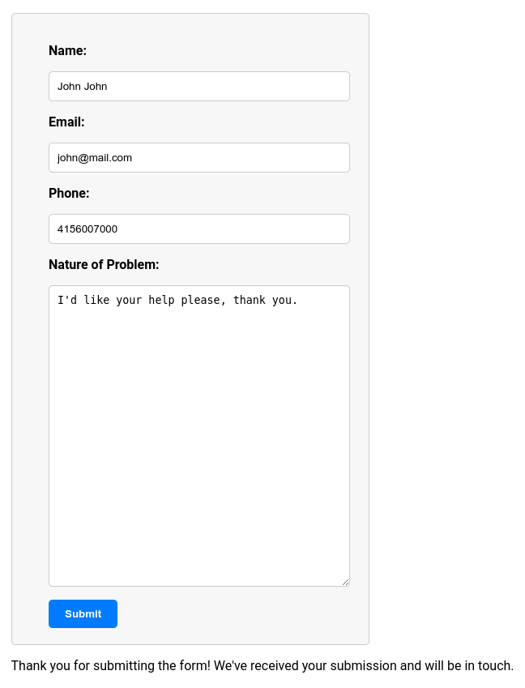

# User Form

## Overview

This one-page TypeScript app using React accepts user input and uploads the data to an API endpoint.

If your endpoint works, and the fields match, you'll be able to save the data. 

This code has been confirmed to work with my own personal API endpoint (not included).

## Features

This app is written in TypeScript, with React. It shows a form where the user can enter their data, press Submit, and send the data to the API. 

If the submission is successful, the user will be thanked and told we'll be in touch. If not, the reason for the failure is given.

If you don't have an API endpoint to upload to, you can use the form and submit data, but you'll receive a message saying the API request was not successful (which is fine if all you want to do is see how it works).

To compare this TypeScript code to similar JavaScript code also using React for the same purpose, see this [gist](https://gist.github.com/julianeon/767e32fc069d0a1568683deb4dd31fb0) and this [blog post](https://javascriptpage.com/make-an-email-submit-form-with-javascript) explaining how to make an email submit form with JS.

## How to Run

In the project directory, you can run:

### `npm start`

Open [http://localhost:3000](http://localhost:3000) to view it in the browser.

The page will reload if you make edits.

## Learn More

This app was created with [Create React App](https://facebook.github.io/create-react-app/docs/getting-started) using [React](https://reactjs.org/).
